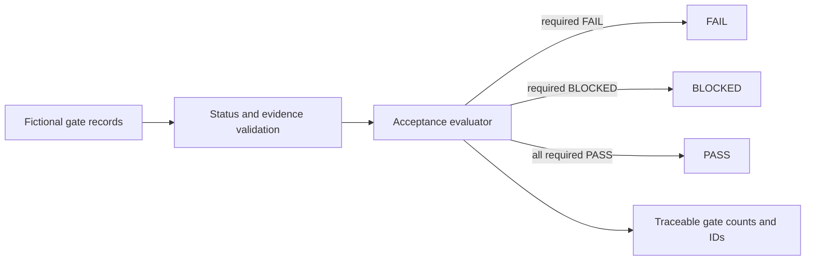

# Proofline Release Review

> **Independent technical work sample.** The main Proofline application's requirements,
> names, dates, evidence and release behavior are fictional. This is not client work,
> a live release system or evidence of a production outcome.
>
> The separate [30 September work samples](samples/2026-09-30/README.md) use explicitly
> cited public observations and labelled synthetic inputs. They are independent
> AI-assisted prototypes, not commissioned work, endorsements or deployed client fixes.

A self-contained release-review interface plus an executable acceptance model.
It shows how requirements, evidence, failure states, and unresolved gates can
produce an explicit `PASS`, `FAIL`, `BLOCKED`, or `NOT_APPLICABLE` decision.

[Live interface](https://builtbyhuy.github.io/proofline-release-review/) ·
[Architecture](docs/ARCHITECTURE.md) ·
[Acceptance model](docs/ACCEPTANCE_MODEL.md) ·
[Verification and handoff](docs/VERIFICATION.md) ·
[Demo script](docs/DEMO_SCRIPT.md)

## Problem

Release discussions often collapse requirements, evidence, risk, and ownership
into one vague “ready” label. Proofline keeps the missing gate visible. The
fixture release has four evidenced gates and one blocked performance gate, so
the executable decision remains `BLOCKED`.

## Reviewer and relevant use

The intended reviewer is an engineering manager, delivery owner, release lead,
or agency technical reviewer who needs one bounded release decision tied to
inspectable evidence. This proof is relevant when acceptance criteria exist but
ownership, evidence sufficiency, failure precedence, or the final go/no-go state
is still ambiguous.

The next action is to provide one fictional or sanitized release gate and its
acceptance evidence for a bounded review. Proofline should not receive production
credentials or be treated as a deployment controller.

## What is implemented

- A responsive dependency-free interface with ready, loading, empty, and
  recoverable error states.
- Semantic landmarks, native controls, visible keyboard focus, a skip link,
  polite state announcements, and reduced-motion handling.
- A real regression fix: retrying from the error state moves focus to the visible
  Loading control instead of leaving focus on a hidden button.
- A pure JavaScript acceptance evaluator that validates statuses, rejects
  duplicate gates, blocks asserted passes without evidence, and gives `FAIL`
  precedence over `BLOCKED`.
- A committed fictional release fixture and CLI verification report.
- Node unit tests, Python source/link contracts, and Playwright browser tests at
  desktop and 390px mobile width.
- Deterministic CI with no API keys, analytics, backend, or application network
  dependency.

## Quick start

Requires Node.js 20+, npm, Python 3, and Chromium for the browser tests.

```bash
npm ci
npx playwright install chromium
npm run verify
```

Inspect only the executable release decision:

```bash
npm run release:verify
```

Open `index.html` directly, or serve it:

```bash
python3 -m http.server 8765
```

Then visit `http://127.0.0.1:8765/`. Query states are also available at
`?state=ready`, `?state=loading`, `?state=empty`, and `?state=error`.

## Architecture and verification

The static interface has no runtime service dependency. `acceptance.js` is a
separate pure decision boundary used by unit tests and
`scripts/verify-release.js`; `data/release-08.json` is its fictional input.



See [`docs/ARCHITECTURE.md`](docs/ARCHITECTURE.md) and
[`docs/VERIFICATION.md`](docs/VERIFICATION.md) for an immutable reviewer path,
the expected decision, handoff contents, owner decisions, and rollback boundary.

## Acceptance contract

1. No external script, stylesheet, font, API, analytics, or asset request is
   needed by the interface.
2. Every UI state is reachable through a native button and announced without
   losing the user's place.
3. Retry from the error state leaves keyboard focus on a visible control.
4. The desktop layout works at 1280px and page-level horizontal overflow is
   absent at 390px.
5. A required `PASS` gate without evidence is converted to `BLOCKED`.
6. A failed required gate makes the release `FAIL`; otherwise any blocked
   required gate makes it `BLOCKED`.
7. The truth label remains visible and no client or production provenance is
   implied.

## Repository map

- `index.html` — self-contained interface.
- `acceptance.js` — deterministic acceptance evaluator.
- `data/release-08.json` — fictional five-gate release fixture.
- `scripts/verify-release.js` — exact release-state report.
- `tests/unit/` — acceptance-model contracts.
- `tests/e2e/` — browser interaction, focus, state, and mobile checks.
- `tests/test_source_contract.py` — local-link, offline-asset, state, and document
  contracts.
- `docs/` — architecture, acceptance semantics, demo, verification, limitations,
  and the real focus-loss debugging case.

## Limitations

Proofline has no backend, persistence, authentication, role enforcement, real
import pipeline, actual 10k-row benchmark, deployment control, production logs,
or integration with a ticket/CI/release system. The displayed product workflow
and evidence counts are fictional. See [`docs/LIMITATIONS.md`](docs/LIMITATIONS.md).
