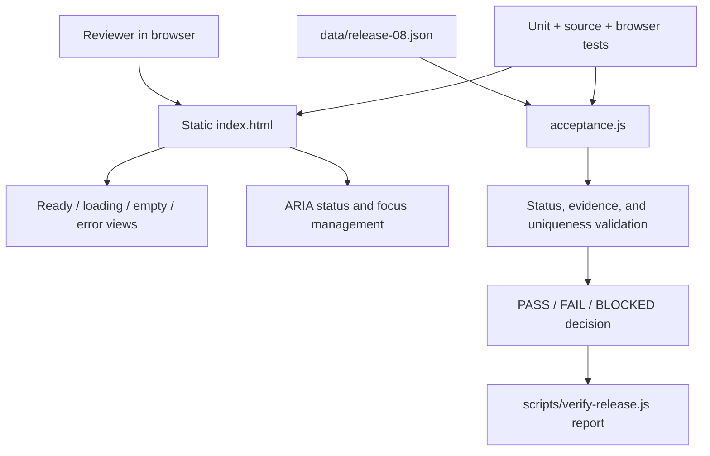

# Architecture

## Interface boundary

`index.html` is a self-contained static interface. It does not fetch a backend,
font, analytics script, or remote asset. State controls toggle four pre-rendered
views, update a polite live region, and preserve a visible keyboard target after
the error retry transition.

## Acceptance boundary

`acceptance.js` is a pure function. It rejects invalid statuses and duplicate IDs,
normalizes missing evidence to `BLOCKED`, and computes release state from required
gates. A required `FAIL` takes precedence; otherwise a required `BLOCKED` blocks
the release; only fully evidenced required gates produce `PASS`.

## Fixture boundary

`data/release-08.json` is explicitly fictional. Its performance gate is blocked,
so `scripts/verify-release.js` must report `BLOCKED`. It is separate from the UI
to keep the acceptance logic executable without pretending the static page is a
real release backend.

## Tradeoffs

- A static interface makes visual and accessibility review easy but cannot prove
  server-side authorization, persistence, or evidence integrity.
- A small pure evaluator makes decision semantics testable without adding a
  framework or artificial service architecture.
- Playwright adds a maintained test dependency because focus and responsive
  behavior cannot be proven by source-string checks alone.
